- theme : night
- title : Foo !

***

## Links

- Internal : [First chapter](chapter_001.html)
- External : [Wikipedia](http://www.wikipedia.org)

---

## Basic formatting

- Strong : **example**
- Italics : _example_
- Italics alternative : *italics*
- Inline code : `example`
- Quote before italics : '_example_ (should be a quote before the example)
- Italics + strong : **_example_**

---

## Formatting bug test

- Formatting on the first char of a bullet should work
- _italics_
- **bold**
- **_both_** <- bug here

---

## Image


---

# Speaker notes

- Some content

' trying out notes
' on multiple lines
'without a space
and what happens if there is no quote ?
' maybe it continues

---

## Math

$x / y = cos(56.2)^2$

---

## YAML code block

```yaml
foo: false
bar: baz
```

---

## Non ascii chars

- sdlkjfhjdskjlfhlkjs kljh dkljfhs dkjfh 
	- ço_è_çesqèfxmdxzstr^àç)do podqikpomlio

---

## Table

| Col1 | Column 2   | Wow   |
| ---  | --------   | ---   |
| 42   | Some value | Nope! |

---

## Code blocks in list items

- Sql example

```sql
SELECT TOP 10 * FROM Customer;
```

- Markdown example
  
```md
## Foo
- Wow much nesting
```

***

# Mermaid samples

---

## Mindmap

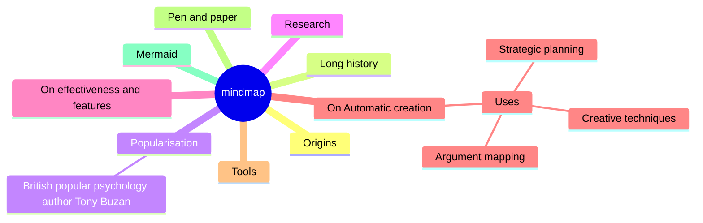

---

## Gitgraph

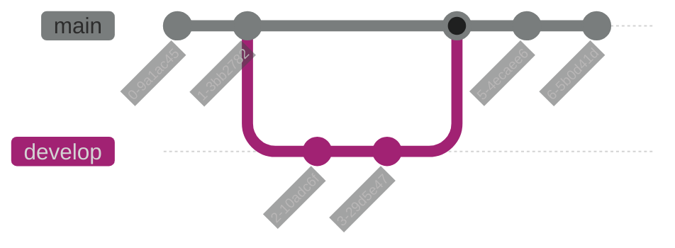

---

## Requirements

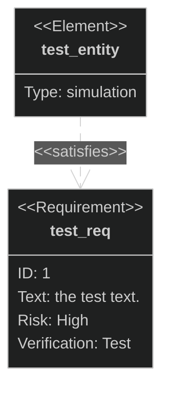

---

## Chart

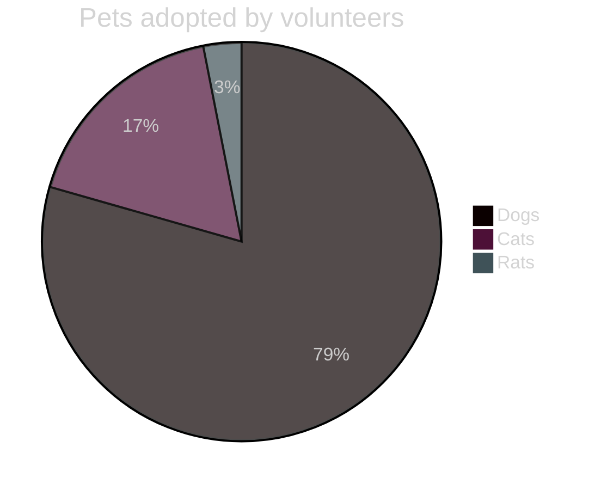

---

## Gantt

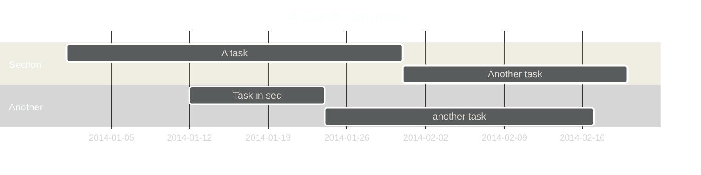

---

## User journey

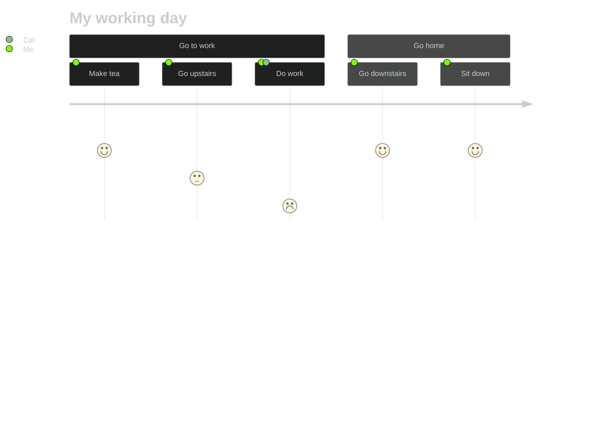

---

## ER

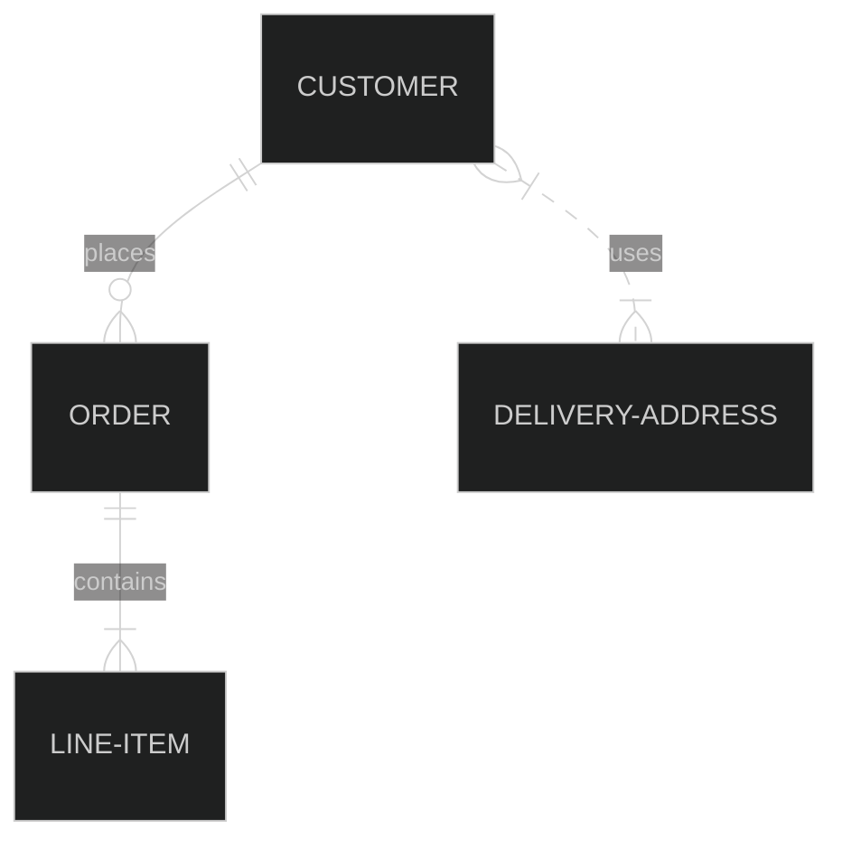

---

## State

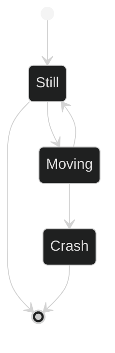

---

## Class

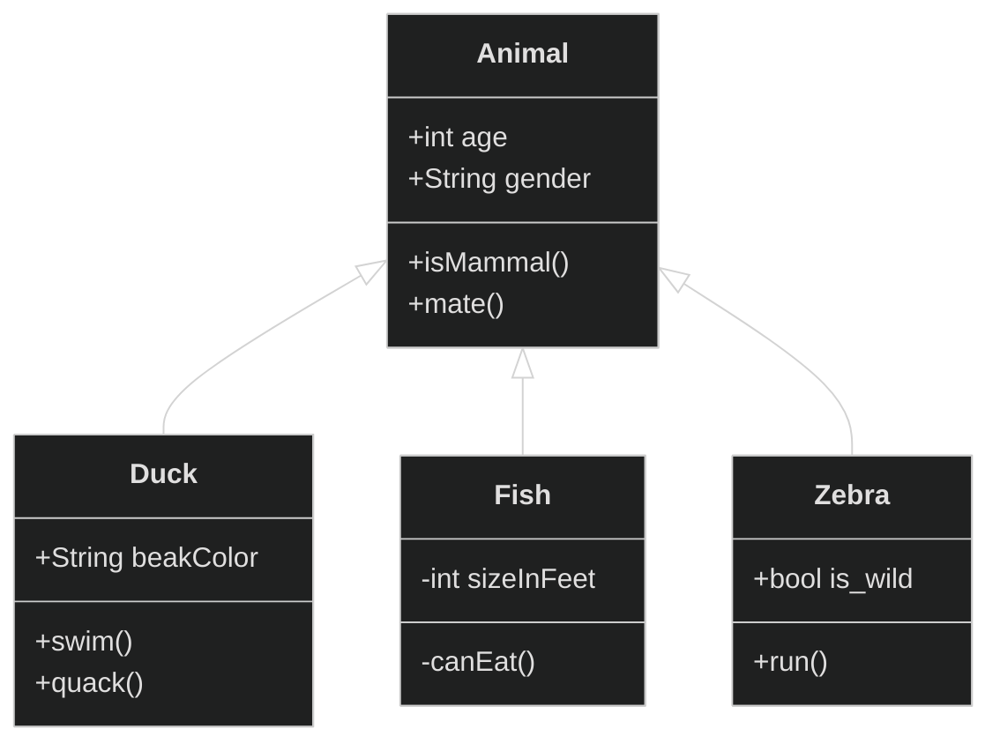

---

## Seq

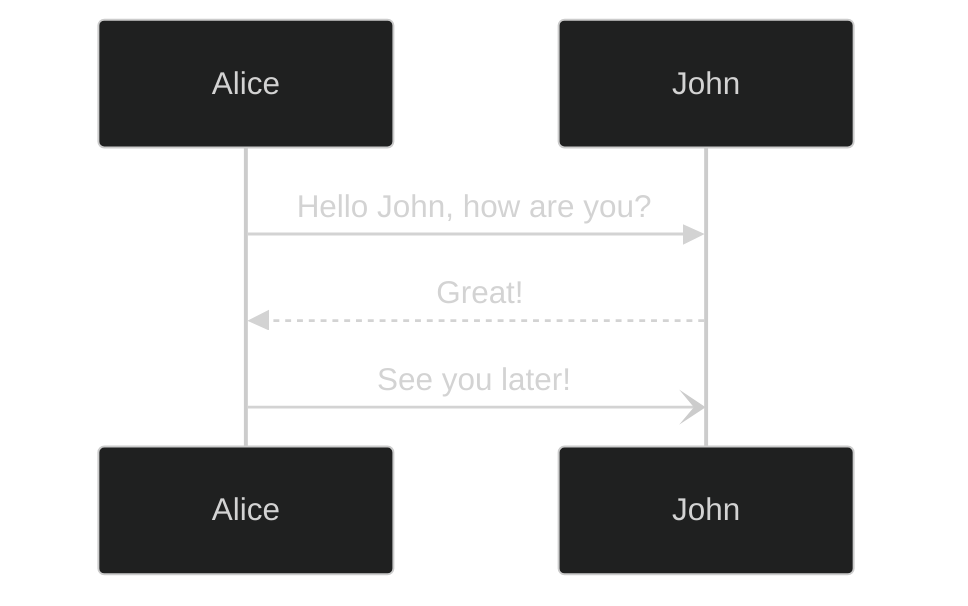
---

## Flow

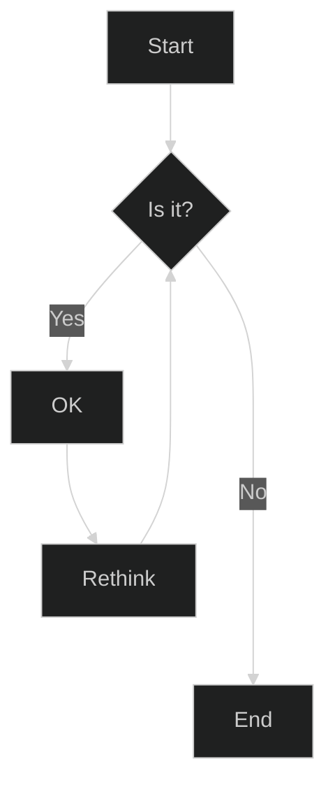